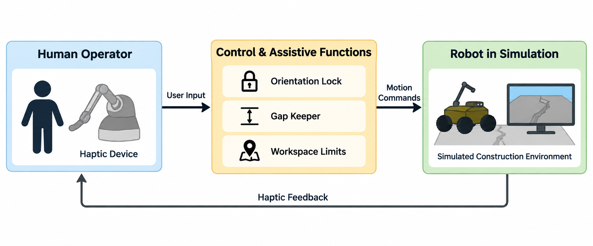

# TouchX Haptic Teleoperation

A Unity-based haptic teleoperation framework integrating assistive kinematic control and graphical feedback for remote robotic manipulation.

## System Overview

The platform connects a haptic user interface with a simulated robotic system, providing bidirectional motion control and force feedback with assistive teleoperation functions.

  

## Demo

The following demonstration shows the Unity-based teleoperation environment and robotic manipulation workflow.

  

